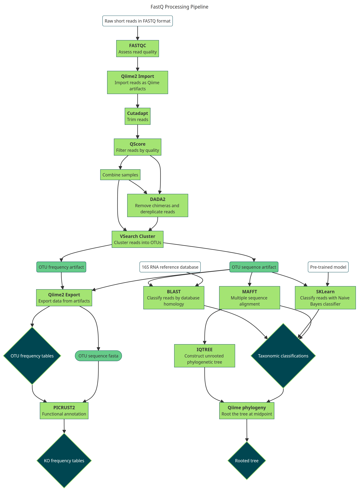

```{r echo=FALSE, results='hide', message=FALSE, comment=NA}
source("./all_artifacts.r")
```
### Overview
- Why study cryosphere microboiomes?
  - Microorganisms in extreme environments unique properties which could be exploited for biotechnology
  - Due to global warming, we need to understand what happens to these habits if we lose them

#### Questions
- 1) How do the different habitats differ by taxonomic and functional diversity?
- 2) What taxa and functions are most associated with cryospheric environments? Do these differ between habitats?
- 3) Can we accurately classify what samples belong to which site using high-level taxonomic ranks?

#### Hypothesis
- We will observe greater taxonomic diversity between sites than functional diversity
  - There is a limited number of adaptations that microorganisms can evolve to survive in cryospheric environments, so we should expect a significant degree of convergent evolution towards the same pathways

### Pipeline

#### Overview
- The Nextflow pipeline used to process the reads first performs quality control, including trimming and contaminant removal.
  - Afterwards, it combines reads using a 99% similarity threshold into operational taxonomic units or OTUs. The idea is that because every otu is unique, each one represents an individual species
```{r comment=NA}
# A single FastQ sequence has three components
example <- read.delim("./data/raw/Bihor_Mountain/SRR2998649.part-1.fastq")
show <- paste(c(example[4, ], example[5, ], example[6, ], example[7, ]), collapse = "\n")
message(show)
```
- **Input:**
  - Raw reads in FastQ format: 13 sites, 10 samples each
    - A non-cryoconic sample ("New Zealand soil") was added as an "outgroup" comparison
  - Databases,
  - Pre-trained classifier model
- **Output:**
  - OTU frequency tables,
  - Taxonomic classifications of each OTU,
  - Pathway frequency table
  - Rooted phylogenetic trees


##### Importing data from fastq
Qiime2 uses a compressed type of file format called an 'Artifact' for its analyses. Artifacts have different semantic types e.g. `FeatureData[Sequence]`, `Phylogeny[Unrooted]` depending on the type of data they contain. To begin the analysis, the fastq files were imported into `FeatureData[SequencesWithQuality]` or `FeatureData[PairedEndSequencesWithQuality]` artifacts

- Although all of these reads were prepared with Illumina devices, sequencing quality can vary between sequencing centres, meaning that each sample will likely need specific parameters for cleaning.
  - This means that each sample needs to be imported into separate artifacts, then merged once they have been cleaned.
- Quality $(Q)$ is commonly measured in Phred scores, denoted as $Q=-10 \log_{10}P$, where $P$ is the probability of an incorrect base call. Therefore, higher values for Phred indicate a lower probability of an erroneous base. Every base position is given a Phred score, and it is common to see the score decrease the longer the read

```bash
# Relevant commands
qiime tools import \
  --type 'SampleData[PairedEndSequencesWithQuality]' \
  --input-path devon.tsv \
  --output-path devonFQ.qza \
  --input-format PairedEndFastqManifestPhred64V2

qiime tools import \
  --type 'SampleData[SequencesWithQuality]' \
  --input-path neem.tsv \
  --output-path neem.qza \
  --input-format SingleEndFastqManifestPhred33V2
```

##### Database preparation
- Two databases were obtained:
  - All annotated 16S rRNA from the NCBI ftp [website](https://ftp-ncbi-nlm-nih-gov.ejournal.mahidol.ac.th/blast/db/v5/)
  - Annotated 16S rRNA used by the tool [MicFunPred](https://github.com/microDM/MicFunPred)
  - A 16S rRNA database from [EzBioCloud](https://www.ezbiocloud.net/dashboard)

The MicFunPred and NCBI databases were obtained in the standard BLAST format, and need to be converted into compatible data types for import into the qiime2 workflow. Specficially, I needed to convert them into FASTA format with an associated taxonomy mapping file (in HeaderlessTSVTaxonomyFormat)

- **Steps**
  - 1. Extract all entries from the database in FASTA format
  - 2. Extract the header and convert it into the HeaderLessTSVTaxonomyFormat, which is a tab-delimited file of FASTA identifiers followed by their taxonomic assignments
  - 3. Remove the taxonomic assignments from the original FASTA file
  - 4. Concatenate the respective files types together, then import them files as qiime2 Artifacts
  - 5. Repeat for the other database (if both databases used the identifier conventions I could have combined them and processed them together but unfortunately this was not the case )

```{r cols.print=4, rows.print=4, comment=NA, message=FALSE, comment=NA}
# The database of identifiers
database_example <- read_tsv("./data/blastdb/all_uniqIDs.txt")
database_example
```

```bash
# 1
blastdbcmd -db NCBI_16S/16S_ribosomal_RNA -entry all > NCBI_16S.fasta
blastdbcmd -db micfun/micfun16S -entry all > micfun.fasta

# 2
grep '>' NCBI_16S.fasta | tr -d '>' | sed 's/ /\t/' | sed 's/ /_/g' > NCBI_16SID.txt
grep '>' micfun.fasta | tr -d '>' | sed 's/_/\t/' | sort | uniq > micfunID.txt # Unfortunately several of the headers repeat

# 3
cat micfun.fasta | sed 's/_.*//' > micfunID.fasta
cat NCBI_16S.fasta | sed 's/ .*//' > ncbi16sID.fasta

# 4
cat micfunID.txt NCBI_16SID.txt EzBioCloud/ezbiocloud_id_taxonomy.txt > all_mappings.txt
cat EzBioCloud/ezbiocloud_qiime_full.fasta ncbi16sID.fasta micfun.fasta > all.fasta
qiime tools import     --type FeatureData[Taxonomy]     --input-format HeaderlessTSVTaxonomyFormat     --input-path all.fasta     --output-path all_fasta.qza
qiime tools import     --type FeatureData[Taxonomy]     --input-format HeaderlessTSVTaxonomyFormat     --input-path all_uniqIDs.txt     --output-path Ids.qza
```
Altogether, the database contains 130,122 sequences (though there might be some repetition that was overlooked)

```python
# Script for removing redundant ids
from Bio import SeqIO
import csv

exists: set = set()
mapped = open('all_uniq.fasta', 'w+')
for seq in SeqIO.parse('all.fasta', 'fasta'):
    if seq.id in exists:
        continue
    exists.add(seq.id)
    mapped.write(f'>{seq.id}\n')
    mapped.write(f'{seq.seq}\n')
mapped.close

uniq = open('all_uniqIDs.txt', 'w+')
exists2: set = set()
with open('all_mappings.txt', 'r') as i:
    for id in csv.reader(i, delimiter='\t'):
        if id[0] in exists2:
            continue
        exists2.add(id[0])
        uniq.write(f'{id[0]}\t{id[1]}\n')
uniq.close
```

### Diversity analyses
- Diversity metrics describe the community composition of an area: the more diverse an area is, the higher the number of species and the more different each species is to aone another. They provide quantitative measures for site comparisons, rather than simply counting the number of species.
  - Alpha diversity describes the biodiversity within a single site, whilst beta diversity compares two sites directly

#### Alpha diversity

```{r, comment=NA, message=FALSE, comment=NA}
alpha <- get_artifact_data("./results/7-Diversity",
  id_key,
  extension = "",
  metric_list = alpha_metrics
)
faith <- data.frame(row.names = 1:10)
for (site in names(id_key)) {
  faith[[id_key[[site]]]] <- alpha[[site]]$fa[, 2]
}
faith_div_plot <- faith %>%
  gather() %>%
  ggplot(aes(x = value, y = key, fill = key)) +
  ggridges::geom_density_ridges2() +
  guides(fill = "none") +
  labs(y = "Site", x = "Faith diversity")
faith_div_plot
```
Evenness quantifies the distribution of species in a site; the higher the evenness, the more balanced the number of each species.
- Low evenness indicates that a site consists mainly of a few very common species

```{r, comment=NA}
pi_evenness <- data.frame(row.names = 1:10)
for (site in names(id_key)) {
  pi_evenness[[id_key[[site]]]] <- alpha[[site]]$pi[, 1]
}
even_plot <- pi_evenness %>%
  gather() %>%
  ggplot(aes(x = key, y = value, fill = key)) +
  geom_boxplot() +
  guides(fill = "none") +
  labs(x = "Site", y = "Evenness", title = "Pielou evenness")
even_plot
```
It's pretty clear that some sites have much lower evenness than others. Others, like the Barrow mountain sites, Bihor mountains and Catriona snow seem similar from the box plot. Whether or not the difference in evenness is statistically significant can be tested with Kruskal wallis

```{r, comment=NA}
pi_evenness %>%
  select(all_of(c("Barrow mountain high", "Barrow mountain low", "Bihor mountains", "Catriona snow"))) %>%
  kruskal.test()
```

### Beta diversity
Beta diversity quantifies the distance/dissimilarity between sites and is measured on a scale of 0 (identical) to 1 (completely different).

####  But why use different metrics?
- Besides total species counts, two other sets of information can be used in the diversity calculation
  - **Abundance:** the individual counts for each species e.g. 100 observations of species A, 20 of B
  - **Phylogenetic distance:** the evolutionary relationships between each species
- Metrics differ by the information they include in their calculation

##### But what is phylogenetic distance?
```{r, comment=NA}
otu_freqs <- lapply(get_artifact_data("./results/2-OTUs", id_key, "otuFreqs"), as.data.frame)
fasttree <- get_artifact_data("./results/6-RootedTrees", id_key, "FastTree_RootedTree")
# Approximate maximum likelihood trees, quick and useful for testing data
iqtree <- get_artifact_data("./results/6-RootedTrees", id_key, "IQTREE_RootedTree")
# Real maximum likelihood trees, accurate, but slow

# Annotate an example tree
matched <- match(iqtree$GrI$tip.label, rownames(otu_freqs$GrI))
freq_mapping <- otu_freqs$GrI[matched, ] %>%
  rowMeans() %>%
  as.data.frame() %>% # Replace the rownames with something readable
  `rownames<-`(seq_along(rownames(.)) %>% paste("OTU", ., sep = ""))
iqtree$GrI$tip.label <- paste(rownames(freq_mapping), "freq =", freq_mapping[[1]])
sample_tree <- iqtree$GrI %>%
  ggtree(layout = "roundrect", aes(color = "#A4E473")) +
  geom_tiplab(size = 3, color = "#004651") +
  geom_tippoint(color = "#66CC8A") +
  labs(title = "Phylogenetic tree of Cryoconite samples") +
  theme(legend.position = "none", axis.text = element_text(size = 5))
sample_tree
```

##### Ordination
Beta diversity calculations on multiple sites at once returns a distance matrix, where the first row and column are sites and entries are. The results can be visualized using a dimensionality reduction technique called principle coordinates analysis
- The PcOA plots here were calculated directly with Qiime2 in an extension to the pipeline

###### Import results and plot
```{r, comment=NA}
beta <- get_artifact_data("./results/7-Diversity", list(Merged = NULL), extension = "", metric_list = beta_metrics)
pcoa2D <- get_artifact_data("./results/8-Analysis", list(Merged = NULL),
  extension = "PCOA-2D_",
  metric_list = beta_metrics
)
pcoa2D_merged <- lapply(pcoa2D$Merged, metadata_merge_pcoa, metadata = metadata)

pcoaja <- plot_pcoa(pcoa2D_merged$ja, "Location") +
  labs(x = "PC1", y = "PC2", title = "Jaccard distance")

pcoabc <- plot_pcoa(pcoa2D_merged$bc, "Location") +
  labs(x = "PC1", y = "PC2", title = "Bray Curtis")

pcoauu <- plot_pcoa(pcoa2D_merged$uu, "Location") +
  labs(x = "PC1", y = element_blank(), title = "Unwieghted Unifrac")

pcoawn <- plot_pcoa(pcoa2D_merged$wn, "Location") +
  labs(x = "PC1", y = element_blank(), title = "Weighted normalized Unifrac")

pcoa_arrange <- ggarrange(pcoabc, pcoauu, pcoawn, ncol = 3, common.legend = TRUE, legend = "right")
pcoa_arrange
```

Clustering in the Bray Curtis plot represents sites sharing many of the same species and in similar abundances. The big cluster falls apart once we factor the evolutionary distance between OTUs, shown by the Unifrac metrics.
- This implies that although some taxa are shared, the unique taxa are a evolutionary distant (essentially have very different DNA) from the shared ones.
- Once we add weightings by abundance though, new clusters form, indicating there are many more common taxa within the groups than there are unique taxa.
  - Even partitioning sites by habitat type - glacier and permafrost, doesn't help
- **Conclusions**
  - Many of the sites share the same taxa, but their phylogenetic relationships differ significantly
  - There is little overlap with the taxa in cryospheric and soil environments
  - The Hailstone site is the most distinct, when considering distance phylogenetic distance

###### What to choose?
```{r, comment=NA}
# Filter the sites
keep <- c("ViS", "BrL", "BrH", "SvG")
filter_wn <- filter_dm(beta$Merged$wn, keep)
filtered_meta <- filter_meta(metadata, keep)
```

### PERMANOVA & ANOSIM
Within the chosen cluster, its visually unclear whether or not the differences between sites are significant. There are specific hypothesis tests for this problem, such as Permutational Analysis of Variance (PERMANOVA) and Analysis of Similarities (ANOSIM)
- These allow you to say with confidence whether or not certain variables (in this case location) are generating a statistically significant difference in species composition
  - Both PERMANOVA and ANOSIM test the null hypothesis that within-group distances from each group are identical to between-group distance.
  - With this dataset, rejecting the null hypothesis and concluding that between-group distance is different from within-group distance will let us conclude that different locations do have statistically significant species distribution.

```{r, comment=NA}
adonis2(filter_wn ~ filtered_meta$Location)
anosim(filter_wn, grouping = filtered_meta$Location)
```

### Pathway analysis
- A metabolic pathway is essentially a set of reactions operating together for a specific purpose, such as energy storage or producing a certain molecule.
  - These tell us about how the microorganisms are interacting with each other and their environment
  - Performing a beta diversity analysis on the set of metabolic pathways will reveal the functional similarity of each site

```r
# Export for far pro tax database
otu_genus <- list()
for (id in names(id_key)) {
  otu_genus[[id]] <- to_genus_csv(otu_freqs[[id]], blast[[id]])
}
genus_combined <- combine_freqs(otu_genus, taxon)
write.csv(combined, "genus_otu_tables.csv", row.names = FALSE)
```
### Import PICRUSt2 output
```{r cols.print=4, rows.print=4, comment=NA}
ko_all <- ko %>%
  # Merge the PICRUSt2 tables
  reduce(merge, by = "pathway", all = TRUE) %>%
  as_tibble() %>%
  replace(is.na(.), 0) %>%
  rel_abund(., pathway) %>% # Convert to relative abundances
  as_tibble()
ko_xfunc <- ko_all %>% sites_x_func() # Transpose into sites x function format
ko_all
```

The raw output tables here are the abundances of inferred biological pathways in each site based on the MetaCyc database.
- PICRUSt2 works by first predicting important reactions for metabolism in the site (using KEGG Orthology (KO) and Enzyme Commission numbers (EC)) format, then using their abundances for pathway inference.

#### Compute distances, then plot
```{r cols.print=4, rows.print=4, comment=NA, message=FALSE, comment=NA}
# Bray-curtis distance
bc_func <- vegdist(ko_xfunc, method = "bray")
pcoa_bc_func <- bc_func %>%
  wcmdscale(k = 2) %>%
  metadata_merge_pcoa(metadata, ., functions = TRUE)
# Jaccard distance
ja_func <- vegdist(ko_xfunc, method = "jaccard")

pcoa_ja_func <- ja_func %>%
  wcmdscale(k = 2) %>%
  metadata_merge_pcoa(metadata, ., functions = TRUE)

# Plot and compare with ordination on taxonomy
plot_ja_func <- plot_pcoa(pcoa_ja_func, "Location", functions = TRUE) +
  labs(x = element_blank(), y = element_blank(), title = "Jaccard distance",
    subtitle = "From biological pathways")

plot_bc_func <- plot_pcoa(pcoa_bc_func, "Location", functions = TRUE) +
  labs(x = "PC1", y = element_blank(), title = "Jaccard distance",
    subtitle = "From biological pathways")

func_compare <- ggarrange(pcoaja + labs(x = element_blank()), plot_ja_func, pcoabc, plot_bc_func,
  ncol = 2, nrow = 2, common.legend = TRUE, legend = "bottom"
) + theme(axis.text = element_text(size = 5))

func_compare
```

**Conclusions**:
- Sites differ more by pathway than they do by species
  - Implies that there are a few unique species within each site with a specialized, unique lifestyles, resulting in multiple unique pathways
- The most distinct are the Catriona snow and Greenland ice sites.

### Taxonomic classifications
For sample taxonomic classification, I will be trying out all three of the methods available in qiime2:
```{r cols.print=4, rows.print=4, comment=NA}
blast <- lapply(get_artifact_data("./results/3-Classified", id_key, "BLAST_All"), parse_taxonomy)
blast$CaS # The classifications for the Catriona snow site
sklearn <- lapply(get_artifact_data("./results/3-Classified", id_key, "Sklearn"), parse_taxonomy)
sk_merged <- read_qza("./results/3-Classified/Merged-Sklearn.qza")$data %>%
  parse_taxonomy()
count_identified(sklearn, "Sklearn")
count_identified(blast, "BLAST")
sk_merged
```
The sklearn classifier has a slightly better number of identifications so will be used for all any downstream analyses

### Abundance visualizations

#### Phyla
```{r cols.print=4, rows.print=4, comment=NA}
all <- read_qza("./results/2-OTUs/Merged-otuFreqs.qza")$data
sk_merged <- read_qza("./results/3-Classified/Merged-Sklearn.qza")$data %>% parse_taxonomy()

ranks <- merge_with_id(all, sk_merged, level = 2) %>%
  filter(!(is.na(taxon))) %>%
  group_by(taxon) %>%
  summarise(across(everything(), sum))
# Collapse taxnomy into phyla

not_bacteria <- c(
  "Arthropoda", "Nanoarchaeota", "Diatomea", "Altiarchaeota",
  "Ascomycota", "Basidiomycota", "Cercozoa", "Ciliophora", "Asgardarchaeota",
  "Phragmoplastophyta", "Euryarchaeota", "Crenarchaeota"
) # These are most likely false positives given the specificity of the 16s rRNA primers used to sequence the samples

tax_sum <- sum_by_site(ranks, id_key, "taxon", not_bacteria)

stacked <- tax_sum %>% ggplot(., aes(x = name, y = value, fill = identifier)) +
  geom_bar(stat = "identity") +
  scale_fill_discrete(name = "Phylum") +
  scale_color_paletteer_d("pals::glasbey") +
  labs(x = "Site", y = "Relative abundance", title = "Phyla relative abundance",
    subtitle = "*Putative phyla and false positives (non-prokaryotes) removed") +
    theme(axis.text = element_text(size = 5))
stacked
```

#### Pathways
```{r cols.print=4, rows.print=4, comment=NA}
shown_paths <- c(
  "CHLOROPHYLL-SYN", "GLYCOLYSIS", "TCA", "CALVIN-PWY",
  "PENTOSE-P-PWY", "METHANOGENESIS-PWY", "DENITRIFICATION-PWY", "FERMENTATION-PWY",
  "LACTOSECAT-PWY", "METH-ACETATE-PWY"
)
nice_paths <- ko_all %>%
  filter((grepl(paste(shown_paths, collapse = "|"), pathway)))
path_sum <- sum_by_site(nice_paths, id_key, "pathway", NaN)
heat_path <- path_sum %>% ggplot(., aes(x = name, y = identifier, fill = value)) +
  geom_tile() +
  scale_fill_gradient2(name = "Relative abundance", mid = "seagreen1", low = "springgreen", high = "seagreen") +
  labs(x = "Site", y = "Pathway", )
heat_path
```

### Differential abundance analysis
We know that the sites differ by the taxa and pathways present, but how do we quantify this?
- Differential abundance anlaysis allows us to confidently identifying units(OTUs/pathways) that are more or less present between different samples.
  - Visualizations work well as an overview, but do not scale to the number of OTUs (especially at lower levels...)
  - Traditional statistical methods fail on compositional data (i.e. relative abundances)
- There are many methods available for this, but **Analysis of Compositions of Microbiomes with Bias correction test (ANCOM-BC)**
seems to be the newest and most robust
  - Notably, it accounts for biases related to sampling fraction and can provide p-values and confidence intervals for log-fold change for each unit
- ANCOM-BC works by comparing the differential abundance of every taxon present in one sample against another sample in the dataset, for every pair of samples

```{r cols.print=4, rows.print=4, message=FALSE, warning=FALSE, include=FALSE, comment=NA}
# First we prepare the TreeSummarizedExperiment object
tax_info <- c("Kingdom", "Phylum", "Class", "Order", "Family", "Genus", "Species")
false_positives <- c("Unassigned", "Arthropoda", "Bacteria", "Insecta") # False positives

# Remove the soil site from the abundance anlayses
otus <- read_qza("./results/2-OTUs/Merged-otuFreqs.qza")$data %>% as.data.frame()
otus <- otus %>% select(-(grep("NzS", colnames(otus))))
metadata <- metadata %>% filter(!(grepl("NzS", sample.id)))
paths <- ko_all %>% column_to_rownames(., var = "pathway")
paths <- paths %>% select(-(grep("NzS", colnames(paths))))

# Format the metadata
formatted_meta_paths <- metadata[match(colnames(paths), metadata$sample.id), ] %>%
  `rownames<-`(NULL) %>%
  column_to_rownames(., var = "sample.id") %>%
  sample_data()
phylo_path <- phyloseq(otu_table(paths, taxa_are_rows = TRUE), formatted_meta_paths)
# All of this is necessary because the TSE object won't be
#   created properly unless the indices of the rownames match precisely

matched_tax <- sk_merged[match(rownames(otus), rownames(sk_merged)), ] %>%
  tax_table() %>%
  `colnames<-`(tax_info)
formatted_meta <- metadata[match(colnames(otus), metadata$sample.id), ] %>%
  `rownames<-`(NULL) %>%
  column_to_rownames(., var = "sample.id") %>%
  sample_data()
rownames(otus) <- rownames(matched_tax)
my_phylo <- phyloseq(otu_table(otus, taxa_are_rows = TRUE), formatted_meta, matched_tax)

tse <- mia::makeTreeSummarizedExperimentFromPhyloseq(my_phylo)
tse_paths <- mia::makeTreeSummarizedExperimentFromPhyloseq(phylo_path)
var <- "Type"
chosen_rank <- "Class"
```

```r
# Differentially abundant taxa between cryosphere types
abc <- ancombc2(
  data = tse, assay_name = "counts", tax_level = chosen_rank,
  fix_formula = "Type", group = var,
  pairwise = TRUE
)

lfc <- prepare_abc_lfc(abc, "Type", "res_pair", chosen_rank, false_positives)
# Test takes some time to run, so save results
write.csv2(abc$res_pair, "./results/8-ANCOM-BC/all_taxon_res.csv", row.names = FALSE)
write.csv2(lfc, "./results/8-ANCOM-BC/taxon_lfc.csv", row.names = FALSE)
```

```r
abc_paths <- ancombc2(
  data = tse_paths, assay_name = "counts", tax_level = "Species",
  fix_formula = "Type", pairwise = TRUE, group = "Type"
)
path_lfc <- prepare_abc_lfc(abc_paths, "Type", "res_pair", NA, NA)
write.csv2(abc_paths$res_pair, "./results/8-ANCOM-BC/all_path_res.csv", row.names = FALSE)
write.csv2(path_lfc, "./results/8-ANCOM-BC/path_lfc.csv", row.names = FALSE)
```

#### Differentially abundant Classes
```{r cols.print=4, rows.print=4, comment=NA}
abc_taxon <- read.csv2("./results/8-ANCOM-BC/all_taxon_res.csv")
taxon_all_counts <- abc_taxon %>%
  ancombc_select(glue("diff_{var}"), chosen_rank, false_positives) %>%
  select(taxon) %>%
  unique() %>%
  dim() # Collect counts of all taxa
lfc <- read.csv2("./results/8-ANCOM-BC/taxon_lfc.csv")
class_abund_count <- length(unique(lfc$taxon))

lfc <- quantile_filter(lfc, 0.1)
# We keep the taxa at the 90th and 10th percentiles of log-fold changes between the types
tax_ids <- as.character(1:length(lfc$taxon))
lfc$taxon <- paste(c(glue("{tax_ids}:")), lfc$taxon)
lfc[lfc$name == "Other", ]$name <- "Other vs. Glacier"
lfc[lfc$name == "Permafrost", ]$name <- "Permafrost vs. Glacier"
# The test selects the refrence Type based on alphabetical order ("Glacier" in this case), so I renamed it for clarity
lfc[grep("_", lfc$name), ]$name <- "Permafrost vs. Other"

abc_plot <- abc_lfc_plot(lfc) + scale_fill_discrete(name = "Class") + labs(x = "Type") +
  geom_label(aes(label = tax_ids), label.size = 0.15,
    position = position_dodge(width = .9), show.legend = FALSE
  )

abc_taxon
abc_plot
```

The ANCOM-BC test returns p-values, so the results here are only the log-fold changes that are statistically significant
- **Interpretation:** the x-axis shows the comparisons being made, while the y-axis is the log-fold change in the taxon represented by that bar

**Highlights**
- 66% of Classes (63 out of 96) were differentially abundant between sites
  - The other 33 could represent the "core" microbiome, shared between the habitat types
  - *I specified a cutoff so that the graph only shows the 90th and 10th percentiles so there are actually more that weren't shown
- Permafrost has a significantly lower amount of Cyanobacteria than both sites (bar 18 and bar 5), but higher levels of Desulfuromonadia in both

#### Differentially abundant pathways
```{r cols.print=4, rows.print=4, comment=NA}
all_path_lfc <- read.csv2("./results/8-ANCOM-BC/all_path_res.csv")
path_lfc <- read.csv2("./results/8-ANCOM-BC/path_lfc.csv")

path_all_counts <- all_path_lfc %>%
  ancombc_select(glue("diff_{var}"), NA, NA) %>%
  select(taxon) %>%
  unique() %>%
  dim()
pathway_abund_count <- length(unique(path_lfc$taxon))
percent_abund <- (pathway_abund_count / path_all_counts[1]) %>% round(digits = 2) * 100

path_lfc <- quantile_filter(path_lfc, cutoff = 0.05)
# Because there are so many pathways, keep only the 95th and 5th percentile for log-fold change
ids <- as.character(1:length(path_lfc$taxon))
path_lfc$taxon <- paste(c(glue("{ids}:")), path_lfc$taxon)
path_lfc[path_lfc$name == "Other", ]$name <- "Other vs. Glacier"
path_lfc[path_lfc$name == "Permafrost", ]$name <- "Permafrost vs. Glacier"
# The test selects the refrence Type based on alphabetical order ("Glacier" in this case), so I renamed it for clarity
path_lfc[grep("_", path_lfc$name), ]$name <- "Permafrost vs. Other"

abc_pathways <- abc_lfc_plot(path_lfc) +
  scale_fill_discrete(name = "Pathway") +
  geom_label(aes(label = ids), label.size = 0.15,
    position = position_dodge(width = .9), show.legend = FALSE
  )
all_path_lfc
abc_pathways
```

**Highlights**
- 52% of pathways (216 out of 419) were differentially abundant
  - Reinforces how the habitat types have unique microbial communities
- Compared to Glacier sites, Permafrost has a higher abundance of the vitamin b6 degradation pathway (PWY-5499)
  - In comparison with both Other and Glacier sites, Permafrost is lacking in the benzoyl-CoA degradation (CENTBENZCOA-PWY) pathway

### ANCOM-BC other output
- It returns five metrics for each OTU:
  - Log fold change of the OTU
  - W-score: log fold change across different sites divided by standard error. This is ANCOM-BC's test statistic
  - p value: whether or not the log fold change for a given OTU is statitically significant
  - q value: the adjusted p-values
  - Standard error
- The W value for the *i*th species is the number of times that the null hypothesis is rejected for that species _i_. We can simply interpret higher W values to mean that a species is more abundant than others.
  - W value also works in the opposite direction where negative values mean less abundance

### Random forest for site prediction
- As an extension to one of the assignments, I wanted to build a model that predicts multiple classes. Habitat type ("Permafrost", "Glacier" or "Other") was the only variable that made sense for the dataset
  - Predicting Location would have worked, but I didn't have enoguh samples from each Location for training
- **Predictors:** relative abundances of each phyla
  - Phyla-level predictions are more accurate than lower-level ranks
  - Also reduces the number of features in the model
- A random forest model was the natural choice to reduce overfitting to the specific values of abundance in my dataset

```{r cols.print=4, rows.print=4, comment=NA}
bad_names <- ranks[grep("-", ranks$taxon), ]$taxon
# change the names to stop errors
new_names <- bad_names %>% gsub("-", "_", .)

phyla_abund <- ranks %>%
  rel_abund() %>%
  t() %>%
  as.data.frame() %>%
  `colnames<-`(.[1, ]) %>%
  filter(!(grepl("NzS", rownames(.)))) %>%
  select(!all_of((not_bacteria))) %>%
  rename_with(~"Marinimicrobia", "Marinimicrobia_(SAR406_clade)") %>%
  rename_with(~new_names, bad_names) %>%
  dplyr::slice(-1) %>%
  rownames_to_column("pred") %>%
  mutate_at(.vars = c(1:length(colnames(.)))[-1], .funs = as.numeric) %>%
  as_tibble()

phyla_train <- phyla_abund %>%
  mutate(pred = lapply(pred, function(x) {
    return(filter(metadata, sample.id == x)$Type)
  })) %>%
  mutate(pred = unlist(pred)) %>%
  mutate(pred = as.factor(pred)) # Site needs to be converted to a factor object

num_features <- length(colnames(phyla_train))
# Train the random forest
set.seed(2002)
preds <- sample(2, nrow(phyla_train), replace = TRUE, prob = c(0.7, 0.3))
train <- phyla_train[preds == 1, ]
test <- phyla_train[preds == 2, ]
rf <- randomForest(y = train$pred, x = train[, -1], data = train)
print(rf)
try <- predict(rf, test)
confusionMatrix(try, test$pred)
varImpPlot(rf, main = "Phyla importances")
```
Since the out-of-bag estimate for the error rate is 3.53% so the model is pretty good, even without adjusting any parameters
- This shows that the Phyla abundances (only 54 phyla) is suitable for accurately characterize habitat types

### References
Bokulich, N. A., Kaehler, B. D., Rideout, J. R., Dillon, M., Bolyen, E., Knight, R., Huttley, G. A., & Gregory Caporaso, J. (2018). Optimizing taxonomic classification of marker-gene amplicon sequences with QIIME 2’s q2-feature-classifier plugin. Microbiome, 6(1), 90. https://doi.org/10.1186/s40168-018-0470-z

Bolyen, E., Rideout, J. R., Dillon, M. R., Bokulich, N. A., Abnet, C. C., Al-Ghalith, G. A., Alexander, H., Alm, E. J., Arumugam, M., Asnicar, F., Bai, Y., Bisanz, J. E., Bittinger, K., Brejnrod, A., Brislawn, C. J., Brown, C. T., Callahan, B. J., Caraballo-Rodríguez, A. M., Chase, J., … Caporaso, J. G. (2019). Reproducible, interactive, scalable and extensible microbiome data science using QIIME 2. Nature Biotechnology, 37(8), Article 8. https://doi.org/10.1038/s41587-019-0209-9

Bourquin, M., Busi, S. B., Fodelianakis, S., Peter, H., Washburne, A., Kohler, T. J., Ezzat, L., Michoud, G., Wilmes, P., & Battin, T. J. (2022). The microbiome of cryospheric ecosystems. Nature Communications, 13(1), Article 1. https://doi.org/10.1038/s41467-022-30816-4

Douglas, G. M., Maffei, V. J., Zaneveld, J. R., Yurgel, S. N., Brown, J. R., Taylor, C. M., Huttenhower, C., & Langille, M. G. I. (2020). PICRUSt2 for prediction of metagenome functions. Nature Biotechnology, 38(6), Article 6. https://doi.org/10.1038/s41587-020-0548-6

Mongad, D. S., Chavan, N. S., Narwade, N. P., Dixit, K., Shouche, Y. S., & Dhotre, D. P. (2021). MicFunPred: A conserved approach to predict functional profiles from 16S rRNA gene sequence data. Genomics, 113(6), 3635–3643. https://doi.org/10.1016/j.ygeno.2021.08.016

National Center for Biotechnology Information (NCBI)[Internet]. Bethesda (MD): National Library of Medicine (US), National Center for Biotechnology Information; [1988] – [cited 2023 Jul 13]. Available from: https://www.ncbi.nlm.nih.gov/

Robeson, M. S., O’Rourke, D. R., Kaehler, B. D., Ziemski, M., Dillon, M. R., Foster, J. T., & Bokulich, N. A. (2020). RESCRIPt: Reproducible sequence taxonomy reference database management for the masses (p. 2020.10.05.326504). bioRxiv. https://doi.org/10.1101/2020.10.05.326504

The UniProt Consortium. (2023). UniProt: The Universal Protein Knowledgebase in 2023. Nucleic Acids Research, 51(D1), D523–D531. https://doi.org/10.1093/nar/gkac1052

Barrow Alaska https://www.ebi.ac.uk/ena/browser/view/PRJEB9043

Catriona snow https://www.ebi.ac.uk/ena/browser/view/PRJEB9658

Bihor Mountain ice caves: https://www.ncbi.nlm.nih.gov/bioproject/305850

Central Yakutia https://www.ncbi.nlm.nih.gov/bioproject/PRJNA734507

South East Iceland glaciers https://www.ncbi.nlm.nih.gov/bioproject/PRJNA678168

Rhizosphere sample (comparison group): https://www.ncbi.nlm.nih.gov/bioproject/873723

Sverdrup glacier: https://www.ncbi.nlm.nih.gov/sra/SRX18256802[accn]

Greenland ice sheet: https://www.ncbi.nlm.nih.gov/sra/SRX6813832[accn]

Storglaciaren https://www.ncbi.nlm.nih.gov/sra/ERX4489723[accn]

Cryoconite https://www.ncbi.nlm.nih.gov/sra/DRX182771[accn]

Villum station https://www.ncbi.nlm.nih.gov/sra/SRX6422141[accn]

Giant hailstone metagenome https://www.ncbi.nlm.nih.gov/sra/SRX17718721[accn] single,

New Zealand soil https://www.ncbi.nlm.nih.gov/sra/SRX828665[accn]
